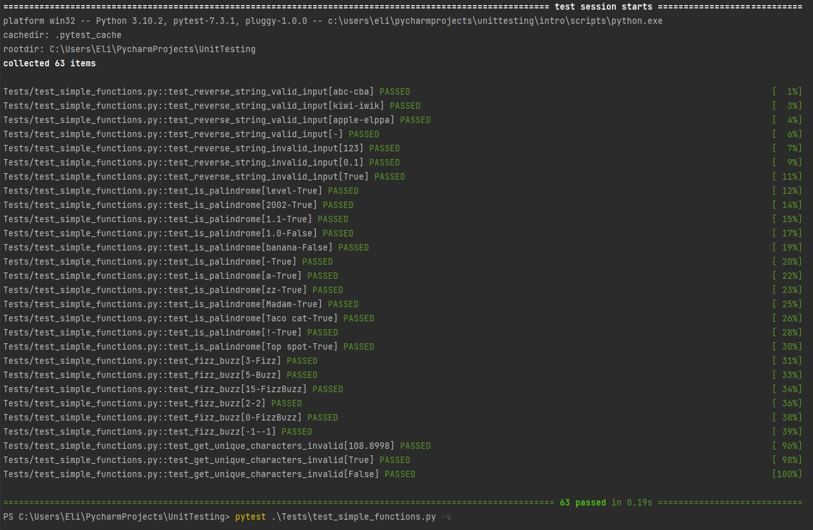

# UnitTests

### Small project to improve UnitTesting

####

The project includes a set of unit tests for each function, implemented using pytest framework.

## Description

This project contains a set of simple functions that perform various operations on strings, numbers, and lists. The
functions provided are:

* reverse_string(text): Reverses the given string
* is_palindrome(text): Checks if the given string is a palindrome
* fizz_buzz(num): Implements the FizzBuzz game for the given number
* is_prime(num): Checks if the given number is prime
* multiply_list_elements(numbers, number): Multiplies each element in the list by the given number
* get_max_between_numbers(a, b): Returns the maximum of two numbers
* get_unique_characters(text): Returns a string with only the unique characters from the input string

## Running the Tests

To run the tests, you need to have pytest installed in your environment. You can install it using the following
command:`pip install pytest`   
Once installed, you can run the tests by executing the following command in the project's root directory:\
`pytest .\Tests\test_simple_functions.py -v`\
The tests will be executed and the results will be displayed, indicating whether each function is working as expected.
You should see this in your terminal:\
\
The test script includes a set of test cases for each function. These tests cover different scenarios and edge cases to
verify the behavior of the functions.
